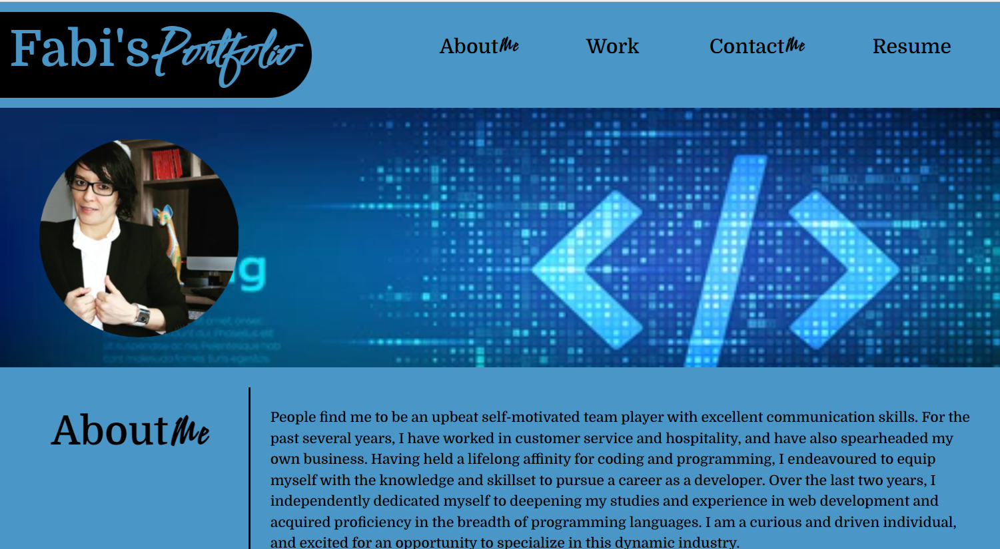
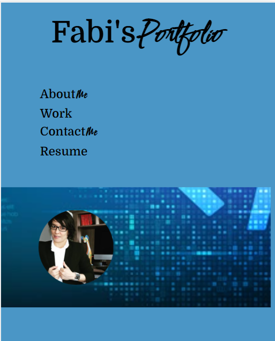

# Professional-Portfolio

## __STORY__ This Website  shows the Work of the student during 2 years of self student. Every single part of this site is a hard 3 days work, you can see that every link that you click brings you to a new page and also you can click in the picture and bring to the sites and work from the developer.

## __ACCEPTANCE CRITERIA__

## __AS A developer__, I want to be able to show all my practice work as a student and a self taught for the last 2 and half years. WHEN I load the portfolio THEN I am presented with the developer's name, a recent photo or avatar, and links to sections about my work, and how to contact me. WHEN I click one of the links in the navigation THEN the UI scrolls to the corresponding section WHEN I click on the link to the section about my work THEN the UI scrolls to a section with titled images of the developer's applications WHEN I am presented with the developer's first application THEN that application's image should be larger in size than the others. WHEN I click on the images of the applications THEN I am taken to that deployed application WHEN I resize the page or view the site on various screens and devices THEN I am presented with a responsive layout that adapts to my viewport

- HTML
- CSS
- Bootstrap

# Information

* Fabiola C. Gamboa
* [Github](https://github.com/Fabskickass/Professional-Portfolio)
* [Email](fabiscg79@gmail.com)

